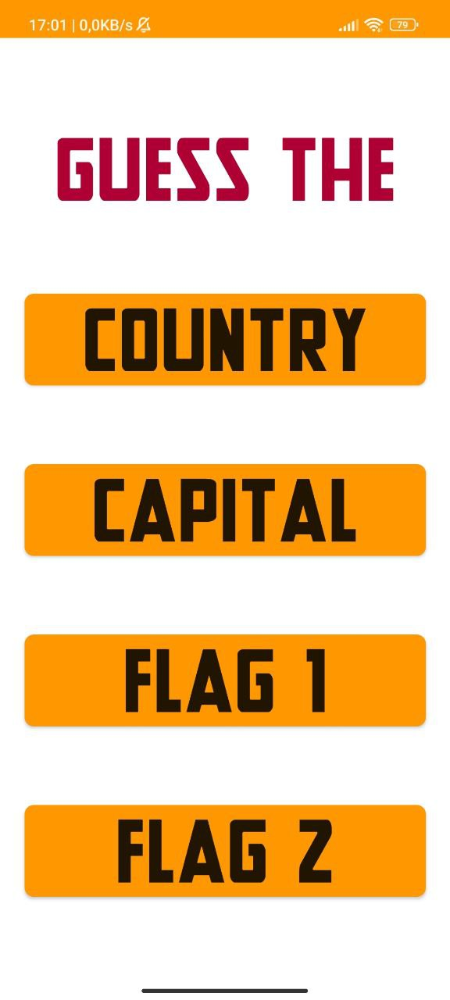

# Flag Guessing App for Android

## Overview

This project consists of a basic flag guessing app designed for Android. 
The app offers an engaging way for users to test their knowledge of countries and capitals 
by guessing the correct answers based on the given flags, country names, or capital names.

## Features

The app includes the following four different modes:

1. **Country Flag Given --> Choose Country Name (4 Options):**
    - In this mode, users are presented with a flag of a country and must select the correct country name from a list of four options.

2. **Country Flag Given --> Choose Capital Name (4 Options):**
    - In this mode, users are shown a flag of a country and are required to choose the corresponding capital city from a list of four options.

3. **Country Name Given --> Choose Country Flag (4 Options):**
    - Users are given the name of a country and must select the correct flag for that country from a list of four options.

4. **Capital Name Given --> Choose Country Flag (4 Options):**
    - In this mode, users are given the name of a capital city and must choose the flag of the country associated with that capital from a list of four options.

## How to Use

To use the app, follow these steps:

1. Download and install the app on your Android device.

2. Launch the app.

3. Choose one of the four modes based on your preference.

4. Begin the game by answering the questions presented in the selected mode.

5. Keep track of your score and aim to improve your knowledge.

## License

This project is open-source and licensed under [GNU General Public License v3.0](LICENSE).
